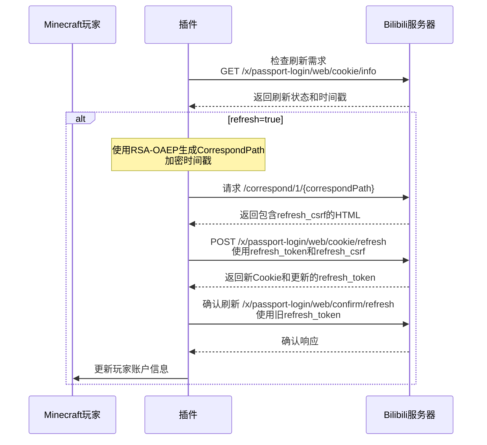

# Bilibili Cookie 刷新 - Minecraft 插件版本

## 概述
本文档提供了在 Minecraft 插件中使用 Kotlin 实现 Bilibili Cookie 刷新的完整指南，支持每个玩家独立刷新自己的登录状态，避免 Cookie 过期导致的 API 调用失败。

## Cookie 刷新流程

Bilibili 的 Cookie 刷新是一个多步骤的过程，包含风控机制：



## API 端点

### 1. 检查刷新需求
- **端点**: `https://passport.bilibili.com/x/passport-login/web/cookie/info`
- **方法**: `GET`
- **认证**: Cookie (SESSDATA)
- **参数**: `csrf` (可选)

### 2. 获取refresh_csrf
- **端点**: `https://www.bilibili.com/correspond/1/{correspondPath}`
- **方法**: `GET`  
- **认证**: Cookie (SESSDATA)

### 3. 刷新Cookie
- **端点**: `https://passport.bilibili.com/x/passport-login/web/cookie/refresh`
- **方法**: `POST`
- **认证**: Cookie (SESSDATA)

### 4. 确认更新
- **端点**: `https://passport.bilibili.com/x/passport-login/web/confirm/refresh`
- **方法**: `POST`
- **认证**: 新的 Cookie (SESSDATA)

## Kotlin 实现

### 数据类定义

```kotlin
import com.google.gson.annotations.SerializedName

// Cookie信息检查响应
data class CookieInfoResponse(
    val code: Int,
    val message: String,
    val ttl: Int,
    val data: CookieInfoData?
)

data class CookieInfoData(
    val refresh: Boolean, // 是否需要刷新
    val timestamp: Long   // 服务器时间戳
)

// Cookie刷新响应
data class CookieRefreshResponse(
    val code: Int,
    val message: String,
    val ttl: Int,
    val data: CookieRefreshData?
)

data class CookieRefreshData(
    @SerializedName("refresh_token")
    val refreshToken: String
)

// 确认刷新响应
data class ConfirmRefreshResponse(
    val code: Int,
    val message: String,
    val ttl: Int
)
```

### RSA-OAEP 加密工具

```kotlin
import javax.crypto.Cipher
import java.security.KeyFactory
import java.security.spec.X509EncodedKeySpec
import java.util.*

class RSAOAEPHelper {
    companion object {
        // Bilibili 公钥 (PEM格式)
        private const val PUBLIC_KEY_PEM = """
            -----BEGIN PUBLIC KEY-----
            MIGfMA0GCSqGSIb3DQEBAQUAA4GNADCBiQKBgQDLgd2OAkcGVtoE3ThUREbio0Eg
            Uc/prcajMKXvkCKFCWhJYJcLkcM2DKKcSeFpD/j6Boy538YXnR6VhcuUJOhH2x71
            nzPjfdTcqMz7djHum0qSZA0AyCBDABUqCrfNgCiJ00Ra7GmRj+YCK1NJEuewlb40
            JNrRuoEUXpabUzGB8QIDAQAB
            -----END PUBLIC KEY-----
        """
        
        /**
         * 生成 CorrespondPath
         * @param timestamp 当前毫秒时间戳
         * @return 加密后的16进制字符串
         */
        fun generateCorrespondPath(timestamp: Long): String {
            return try {
                val plaintext = "refresh_$timestamp"
                val encryptedBytes = encryptRSAOAEP(plaintext.toByteArray(), getPublicKey())
                bytesToHex(encryptedBytes).lowercase()
            } catch (e: Exception) {
                println("生成 CorrespondPath 失败: ${e.message}")
                ""
            }
        }
        
        private fun getPublicKey(): java.security.PublicKey {
            val publicKeyPEM = PUBLIC_KEY_PEM
                .replace("-----BEGIN PUBLIC KEY-----", "")
                .replace("-----END PUBLIC KEY-----", "")
                .replace("\\s".toRegex(), "")
            
            val decoded = Base64.getDecoder().decode(publicKeyPEM)
            val keySpec = X509EncodedKeySpec(decoded)
            val keyFactory = KeyFactory.getInstance("RSA")
            return keyFactory.generatePublic(keySpec)
        }
        
        private fun encryptRSAOAEP(data: ByteArray, publicKey: java.security.PublicKey): ByteArray {
            val cipher = Cipher.getInstance("RSA/ECB/OAEPPadding")
            cipher.init(Cipher.ENCRYPT_MODE, publicKey)
            return cipher.doFinal(data)
        }
        
        private fun bytesToHex(bytes: ByteArray): String {
            return bytes.joinToString("") { "%02x".format(it) }
        }
    }
}
```

### Cookie 刷新实现

```kotlin
import kotlinx.coroutines.*
import org.bukkit.entity.Player
import okhttp3.*
import okhttp3.MediaType.Companion.toMediaType
import okhttp3.RequestBody.Companion.toRequestBody
import java.util.regex.Pattern

class BilibiliCookieRefresher(
    private val httpClient: BilibiliHttpClient,
    private val accountManager: PlayerBilibiliAccountManager
) {
    
    companion object {
        private const val COOKIE_INFO_URL = "https://passport.bilibili.com/x/passport-login/web/cookie/info"
        private const val CORRESPOND_BASE_URL = "https://www.bilibili.com/correspond/1/"
        private const val COOKIE_REFRESH_URL = "https://passport.bilibili.com/x/passport-login/web/cookie/refresh"
        private const val CONFIRM_REFRESH_URL = "https://passport.bilibili.com/x/passport-login/web/confirm/refresh"
        
        private val REFRESH_CSRF_PATTERN = Pattern.compile("<div id=\"1-name\">([^<]+)</div>")
    }
    
    /**
     * 检查玩家的Cookie是否需要刷新
     */
    suspend fun checkRefreshNeeded(player: Player): Boolean {
        return withContext(Dispatchers.IO) {
            val account = accountManager.getPlayerAccount(player) ?: return@withContext false
            
            try {
                httpClient.setCredentials(account.sessdata, account.buvid3)
                
                val url = if (account.biliJct.isNotEmpty()) {
                    "$COOKIE_INFO_URL?csrf=${account.biliJct}"
                } else {
                    COOKIE_INFO_URL
                }
                
                val response = httpClient.getJson<CookieInfoResponse>(url)
                
                if (response?.code == 0) {
                    response.data?.refresh == true
                } else {
                    println("检查Cookie刷新状态失败: ${response?.message}")
                    false
                }
            } catch (e: Exception) {
                println("检查Cookie刷新状态异常: ${e.message}")
                false
            }
        }
    }
    
    /**
     * 为玩家执行完整的Cookie刷新流程
     */
    suspend fun refreshPlayerCookie(player: Player): Boolean {
        return withContext(Dispatchers.IO) {
            val account = accountManager.getPlayerAccount(player)
            if (account == null) {
                println("玩家 ${player.name} 未登录Bilibili账户")
                return@withContext false
            }
            
            if (account.refreshToken.isEmpty()) {
                println("玩家 ${player.name} 缺少refresh_token，无法刷新")
                return@withContext false
            }
            
            try {
                httpClient.setCredentials(account.sessdata, account.buvid3)
                
                // 1. 检查是否需要刷新
                val needRefresh = checkRefreshInternal()
                if (!needRefresh.first) {
                    println("玩家 ${player.name} 的Cookie不需要刷新")
                    return@withContext true
                }
                
                println("开始为玩家 ${player.name} 刷新Cookie...")
                
                // 2. 生成CorrespondPath
                val timestamp = needRefresh.second
                val correspondPath = RSAOAEPHelper.generateCorrespondPath(timestamp)
                if (correspondPath.isEmpty()) {
                    println("生成CorrespondPath失败")
                    return@withContext false
                }
                
                // 3. 获取refresh_csrf
                val refreshCsrf = getRefreshCsrf(correspondPath)
                if (refreshCsrf.isEmpty()) {
                    println("获取refresh_csrf失败")
                    return@withContext false
                }
                
                // 4. 执行Cookie刷新
                val newTokens = performCookieRefresh(account, refreshCsrf)
                if (newTokens == null) {
                    println("Cookie刷新失败")
                    return@withContext false
                }
                
                // 5. 确认刷新（使用旧的refresh_token）
                val confirmed = confirmRefresh(account.refreshToken, newTokens.second)
                if (!confirmed) {
                    println("确认Cookie刷新失败")
                    return@withContext false
                }
                
                // 6. 更新玩家账户信息
                updatePlayerAccount(player, newTokens.first, newTokens.second)
                
                println("玩家 ${player.name} Cookie刷新成功")
                return@withContext true
                
            } catch (e: Exception) {
                println("刷新玩家 ${player.name} Cookie异常: ${e.message}")
                e.printStackTrace()
                return@withContext false
            }
        }
    }
    
    /**
     * 内部检查刷新需求
     * @return Pair<是否需要刷新, 服务器时间戳>
     */
    private suspend fun checkRefreshInternal(): Pair<Boolean, Long> {
        return try {
            val response = httpClient.getJson<CookieInfoResponse>(COOKIE_INFO_URL)
            if (response?.code == 0 && response.data != null) {
                Pair(response.data.refresh, response.data.timestamp)
            } else {
                Pair(false, 0L)
            }
        } catch (e: Exception) {
            Pair(false, 0L)
        }
    }
    
    /**
     * 获取refresh_csrf
     */
    private suspend fun getRefreshCsrf(correspondPath: String): String {
        return try {
            val url = "$CORRESPOND_BASE_URL$correspondPath"
            val request = httpClient.buildRequest(url).build()
            val response = httpClient.client.newCall(request).execute()
            
            if (response.isSuccessful) {
                val html = response.body?.string() ?: ""
                val matcher = REFRESH_CSRF_PATTERN.matcher(html)
                if (matcher.find()) {
                    matcher.group(1) ?: ""
                } else {
                    println("在HTML中未找到refresh_csrf")
                    ""
                }
            } else {
                println("获取refresh_csrf页面失败: ${response.code}")
                ""
            }
        } catch (e: Exception) {
            println("获取refresh_csrf异常: ${e.message}")
            ""
        }
    }
    
    /**
     * 执行Cookie刷新
     * @return Pair<新Cookie列表, 新refresh_token>
     */
    private suspend fun performCookieRefresh(
        account: PlayerBilibiliAccountManager.PlayerBilibiliAccount,
        refreshCsrf: String
    ): Pair<List<Cookie>, String>? {
        return try {
            val formBody = FormBody.Builder()
                .add("csrf", account.biliJct)
                .add("refresh_csrf", refreshCsrf)
                .add("source", "main_web")
                .add("refresh_token", account.refreshToken)
                .build()
            
            val request = httpClient.buildRequest(COOKIE_REFRESH_URL)
                .post(formBody)
                .build()
            
            val response = httpClient.client.newCall(request).execute()
            
            if (response.isSuccessful) {
                val responseBody = response.body?.string()
                val refreshResponse = httpClient.gson.fromJson(
                    responseBody, 
                    CookieRefreshResponse::class.java
                )
                
                if (refreshResponse?.code == 0 && refreshResponse.data != null) {
                    // 提取新的Cookie
                    val newCookies = response.headers("Set-Cookie").mapNotNull { 
                        Cookie.parse(response.request.url, it)
                    }
                    
                    Pair(newCookies, refreshResponse.data.refreshToken)
                } else {
                    println("Cookie刷新响应失败: ${refreshResponse?.message}")
                    null
                }
            } else {
                println("Cookie刷新请求失败: ${response.code}")
                null
            }
        } catch (e: Exception) {
            println("执行Cookie刷新异常: ${e.message}")
            null
        }
    }
    
    /**
     * 确认Cookie刷新
     */
    private suspend fun confirmRefresh(oldRefreshToken: String, newBiliJct: String): Boolean {
        return try {
            val formBody = FormBody.Builder()
                .add("csrf", newBiliJct)
                .add("refresh_token", oldRefreshToken)
                .build()
            
            val request = httpClient.buildRequest(CONFIRM_REFRESH_URL)
                .post(formBody)
                .build()
            
            val response = httpClient.client.newCall(request).execute()
            
            if (response.isSuccessful) {
                val responseBody = response.body?.string()
                val confirmResponse = httpClient.gson.fromJson(
                    responseBody,
                    ConfirmRefreshResponse::class.java
                )
                
                confirmResponse?.code == 0
            } else {
                println("确认刷新请求失败: ${response.code}")
                false
            }
        } catch (e: Exception) {
            println("确认刷新异常: ${e.message}")
            false
        }
    }
    
    /**
     * 更新玩家账户信息
     */
    private fun updatePlayerAccount(
        player: Player,
        newCookies: List<Cookie>,
        newRefreshToken: String
    ) {
        val cookieMap = newCookies.associateBy { it.name }
        
        val updatedAccount = PlayerBilibiliAccountManager.PlayerBilibiliAccount(
            playerUuid = player.uniqueId,
            playerName = player.name,
            sessdata = cookieMap["SESSDATA"]?.value ?: "",
            buvid3 = cookieMap["buvid3"]?.value ?: "",
            dedeUserId = cookieMap["DedeUserID"]?.value ?: "",
            biliJct = cookieMap["bili_jct"]?.value ?: "",
            refreshToken = newRefreshToken,
            loginTime = System.currentTimeMillis()
        )
        
        accountManager.savePlayerAccount(player, updatedAccount)
    }
    
    /**
     * 批量刷新所有在线玩家的Cookie
     */
    suspend fun refreshAllOnlinePlayersCookies(): Int {
        return withContext(Dispatchers.IO) {
            val onlinePlayers = org.bukkit.Bukkit.getOnlinePlayers()
            var successCount = 0
            
            for (player in onlinePlayers) {
                if (accountManager.isPlayerLoggedIn(player)) {
                    try {
                        if (refreshPlayerCookie(player)) {
                            successCount++
                        }
                        // 添加延迟避免请求过于频繁
                        delay(2000)
                    } catch (e: Exception) {
                        println("刷新玩家 ${player.name} Cookie时出错: ${e.message}")
                    }
                }
            }
            
            successCount
        }
    }
}
```

### TabooLib 命令实现

```kotlin
import taboolib.common.platform.command.*
import taboolib.module.lang.*
import kotlinx.coroutines.launch
import org.bukkit.entity.Player

@CommandBody  
object BilibiliCookieCommand {
    
    private val accountManager = PlayerBilibiliAccountManager()
    private val httpClient = BilibiliHttpClient()
    private val cookieRefresher = BilibiliCookieRefresher(httpClient, accountManager)
    
    @CommandHeader(name = "bcookie", permission = "bilibili.cookie")
    fun main(sender: ProxyCommandSender) {
        sender.sendInfo("cookieCommandHelp")
    }
    
    @SubCommand("check")
    fun checkRefresh(sender: ProxyCommandSender) {
        if (sender !is Player) {
            sender.sendError("playerOnly")
            return
        }
        
        if (!accountManager.isPlayerLoggedIn(sender)) {
            sender.sendError("notLoggedIn")
            return
        }
        
        launch {
            try {
                sender.sendInfo("checkingCookieStatus")
                
                val needRefresh = cookieRefresher.checkRefreshNeeded(sender)
                
                if (needRefresh) {
                    sender.sendWarn("cookieNeedRefresh")
                } else {
                    sender.sendInfo("cookieStillValid")
                }
                
            } catch (e: Exception) {
                sender.sendError("checkCookieError", "error" to e.message.orEmpty())
            }
        }
    }
    
    @SubCommand("refresh")
    fun refreshCookie(sender: ProxyCommandSender) {
        if (sender !is Player) {
            sender.sendError("playerOnly")
            return
        }
        
        if (!accountManager.isPlayerLoggedIn(sender)) {
            sender.sendError("notLoggedIn")
            return
        }
        
        launch {
            try {
                sender.sendInfo("refreshingCookie")
                
                val success = cookieRefresher.refreshPlayerCookie(sender)
                
                if (success) {
                    sender.sendInfo("cookieRefreshSuccess")
                } else {
                    sender.sendError("cookieRefreshFailed")
                }
                
            } catch (e: Exception) {
                sender.sendError("cookieRefreshError", "error" to e.message.orEmpty())
            }
        }
    }
    
    @SubCommand("refresh-all")
    @CommandPermission("bilibili.cookie.admin")
    fun refreshAllCookies(sender: ProxyCommandSender) {
        launch {
            try {
                sender.sendInfo("refreshingAllCookies")
                
                val successCount = cookieRefresher.refreshAllOnlinePlayersCookies()
                val totalCount = accountManager.getLoggedInPlayerCount()
                
                sender.sendInfo("batchRefreshResult", 
                    "success" to successCount, 
                    "total" to totalCount
                )
                
            } catch (e: Exception) {
                sender.sendError("batchRefreshError", "error" to e.message.orEmpty())
            }
        }
    }
}
```

### 定时任务实现

```kotlin
import taboolib.common.platform.schedule.SubmitTask
import taboolib.common.platform.Plugin

object BilibiliCookieScheduler : Plugin() {
    
    private val accountManager = PlayerBilibiliAccountManager()
    private val httpClient = BilibiliHttpClient()  
    private val cookieRefresher = BilibiliCookieRefresher(httpClient, accountManager)
    
    // 每小时检查一次Cookie状态
    @SubmitTask(period = 72000) // 72000 tick = 1小时
    fun hourlyCheck() {
        launch {
            try {
                val onlinePlayers = org.bukkit.Bukkit.getOnlinePlayers()
                
                for (player in onlinePlayers) {
                    if (accountManager.isPlayerLoggedIn(player)) {
                        try {
                            val needRefresh = cookieRefresher.checkRefreshNeeded(player)
                            
                            if (needRefresh) {
                                player.sendWarn("cookieExpiringSoon")
                                
                                // 自动刷新
                                val success = cookieRefresher.refreshPlayerCookie(player)
                                if (success) {
                                    player.sendInfo("cookieAutoRefreshSuccess")
                                } else {
                                    player.sendError("cookieAutoRefreshFailed")
                                }
                            }
                            
                            // 添加延迟避免请求过于频繁
                            delay(5000)
                            
                        } catch (e: Exception) {
                            println("检查玩家 ${player.name} Cookie时出错: ${e.message}")
                        }
                    }
                }
                
            } catch (e: Exception) {
                println("定时Cookie检查出错: ${e.message}")
            }
        }
    }
    
    // 每天清理过期账户信息
    @SubmitTask(period = 1728000) // 1728000 tick = 24小时
    fun dailyCleanup() {
        try {
            accountManager.cleanupExpiredAccounts()
            println("已清理过期的Bilibili账户信息")
        } catch (e: Exception) {
            println("清理过期账户时出错: ${e.message}")
        }
    }
}
```

### 语言文件示例

```yaml
# zh_CN.yml
cookieCommandHelp: "&e=== Bilibili Cookie 管理 ==="
checkingCookieStatus: "&e正在检查Cookie状态..."
cookieNeedRefresh: "&c你的Cookie即将过期，建议执行刷新"
cookieStillValid: "&a你的Cookie状态正常"
refreshingCookie: "&e正在刷新Cookie，请稍候..."
cookieRefreshSuccess: "&aCookie刷新成功！"
cookieRefreshFailed: "&cCookie刷新失败"
cookieExpiringSoon: "&c提醒：你的Bilibili登录状态即将过期"
cookieAutoRefreshSuccess: "&a系统已自动为你刷新登录状态"
cookieAutoRefreshFailed: "&c自动刷新登录状态失败，请手动执行 /bcookie refresh"
refreshingAllCookies: "&e正在批量刷新所有玩家的Cookie..."
batchRefreshResult: "&a批量刷新完成：成功 {success}/{total} 个玩家"
checkCookieError: "&c检查Cookie状态失败: {error}"
cookieRefreshError: "&cCookie刷新出错: {error}"
batchRefreshError: "&c批量刷新失败: {error}"
```

## 使用说明

1. **检查Cookie状态**: `/bcookie check`
2. **手动刷新Cookie**: `/bcookie refresh`
3. **批量刷新所有玩家** (管理员): `/bcookie refresh-all`

## 注意事项

1. **refresh_token 必需**: 必须在登录时保存 refresh_token
2. **RSA加密**: CorrespondPath 生成需要 RSA-OAEP 加密
3. **风控机制**: 刷新过程包含多个风控检查步骤
4. **请求频率**: 避免频繁刷新，建议设置合理的检查间隔
5. **错误处理**: 刷新失败时需要用户重新登录
6. **自动化**: 可以设置定时任务自动检查和刷新

## 依赖项

```kotlin
// build.gradle.kts (需要额外的加密依赖)
dependencies {
    implementation("com.squareup.okhttp3:okhttp:4.12.0")
    implementation("com.google.code.gson:gson:2.10.1")
    implementation("org.jetbrains.kotlinx:kotlinx-coroutines-core:1.7.3")
    // RSA加密支持 (通常JDK已包含)
}
```